# 2019_OpenGL

# 1. 과제 설명

## 1.1 개요

이번 과제는 이전 과제였던 Cargame에 L-system을 적용한 3d 장면을 만드는 것이 목표입니다.

본 레포트에서는 과제의 기본 요구사항을 어떻게 적용시켰는지 와 추가한 요소는 어떤 것 인지에 대해 설명하고자 합니다.

이번 과제에서 묘사하고자 한 것은 감 농장입니다.

사진과 같은 감농장을 만들기로 하고 과제를 진행하였습니다.

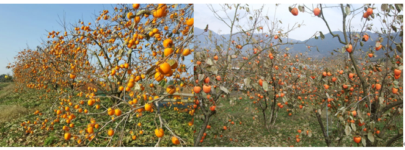

## 1.2 기본 요구사항

본 과제의 기본적인 요구사항은 L시스템을 활용하여 하나 이상의 가지, 잎사귀, 꽃이 있는 5단계의 레벨이 있는 나무를 그리고, Cargame에 적용하는 것 입니다. 따라서 기존에 만들어 두었던 Cargame 코드에 Lsystem 코드를 추가하는 식으로 진행되었습니다.

## 1.3 추가사항

본 과제에서 개인적으로 추가하고자 한 요소들은 다음과 같습니다.

1. L시스템에 따라 나무를 그리는 것 뿐 아니라, 생장 정도에 따라 나무의 굵기, 이파리의 배치, 나무열매의 유무가 달라짐.
2. 오브젝트가 배치될 땅에 텍스쳐를 적용
3. 새로운 매쉬 모델을 임포트 해보기.

---

# 2. Lsystem

## 2.1 기본 적용

기존에 사용하던 코드를 보면 나무의 매쉬 모델을 가져오는 코드는 Treemodel0.h -> TreeModel.cpp 순으로 이어져 있고, Lsystem이 적용되어 나무를 그리기 위해서는 Treemodel.h -> TreeModel.cpp -> Lsystem.h -> Lsystem.cpp 순으로 연결되어 Lsystem에서 나무의 원형을 만든 후 Treemodel에서 해당 원형을 호출하여 배치하는 식으로 코드가 동작합니다.

함수를 하나씩 분석 해보면, Treemodel에서는 initTreeModel() 함수가 5개의 원소를 가지는 1차원 배열 g_tree_mesh을 선언해놓고, 포문을 통해 5종류의 TreeModel을 만들어두고 시작합니다. 그 다음 Lsystem에 선언된 CreateLsystemTree 함수의 인자값으로 현재 Tree의 L 시스템 레벨이 인자로 넘어갑니다. 반면에 기존 코드에서는 해당 함수에서 나무 매쉬를 다 덧붙여서 생성하던 모습을 볼 수 있습니다.

```cpp
void IniTreeModel()
{
	for( int i=0;i<NUM_TREES;i++){
		CreateLSystemTree(i+1,g_tree_mesh[i]);
	}
}
```

```cpp
void CreateLSystemTree(int iteration, Mesh &out_mash)
{
	
	float seed=0;
	srand(time(NULL));
	seed = (float)rand() * iteration;
	// Element 1. 나무기둥 
	Mesh trunk = glm::scale(glm::vec3(0.008f, g_d, 0.008f)) 
				* glm::translate(glm::vec3(0.f, 0.5f, 0.f)) 
				* g_cylinder_mesh;
	trunk.SetColor(0.60f, 0.45f, 0.12f, 1);
	
	// Element 2, 나뭇잎
	Mesh leaf = glm::rotate(glm::pi<float>() / 2.f, glm::vec3(0.f, 1.f, 0.f))
		* glm::rotate(-glm::pi<float>() / 6.f, glm::vec3(1.f, 0.f, 0.f))
		* glm::scale(glm::vec3(0.01f, 0.0004f, 0.03f))
		* glm::translate(glm::vec3(0.f, 0.f, 1.f))
		* g_cylinder_mesh;
	leaf.SetColor(0.f, 0.6f, 0.1f, 1.f);

	// Element 3, 감열매 
	Mesh fruit = glm::scale(glm::vec3(0.02f, 0.015f, 0.015f))
		* g_sphere_mesh;
	fruit.SetColor(0.90f, 0.40f, 0.02f, 1.f);
```

[L시스템 적용시 – initTreeModel은 CreateLsystemTree를 호출하는 동작만 함.]

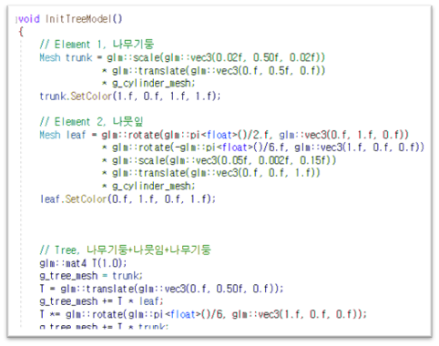

 [기존코드]

그 다음, DrawTreeModel 함수에서 그리고자 하는 나무의 배열 인덱스를 인자로 받아오면 해당 배열에 속하는 나무를 그리는 식으로 원하는 L시스템 레벨의 나무를 그릴 수 있습니다

```cpp
void DrawTreeModel(int i)
{
	glBindVertexArray(g_tree_vao[i]);
	glBindBuffer(GL_ELEMENT_ARRAY_BUFFER, g_tree_index_buf[i]);
	glDrawElements(GL_TRIANGLES, g_tree_mesh[i].num_triangles()*3, GL_UNSIGNED_INT, NULL);
}
```

  [ I 인덱스에 해당하는 나무 매쉬를 그림 ]

Lsystem.h 에는 CreateSystemTree 함수의 원형이 선언되어있는데, int형 변수와 매쉬를 인자로 받아옵니다. Lsystem.cpp 에 L시스템 동작이 구현되어 있습니다. Rule에서 규칙을 정의하고, Reproduce에서 rule 함수에 의해 만들어지는 결과값을 리턴합니다. CreateSystemTree 함수에서 는 엘리멘트를 정의하고, Rule 문자열에 의해 만들어질 모양을 정의합니다. 이는 반복문 안에 들어있어서 L시스템 레벨만큼 반복됩니다.

```cpp
std::string Rule(char in)
{
	std::string out;

	if      ( in == 'X' ) out = "F[+X]F[-X]+X";
	else if ( in == 'F' ) out = "FF";
	else                  out = in;

	return out;
}

std::string Reproduce(std::string input)
{
	std::string output;

	for ( unsigned int i=0; i<input.size(); i++ )
	{
		output = output + Rule( input[i] );
	}

	return output;
}
```

```cpp
for ( int i=0; i<iteration; i++ )
		str = Reproduce(str);
```

[Rule 문자열을 생성]

따라서, 나무의 모양이나 룰을 고치려면 Lsystem.cpp를 수정해야 합니다. rule의 시작 원형은 X이고, X-> F[+X]F[-X]+X , F -> FF 로 대치되는 식으로 L 시스템이 진행됩니다. 이후 나뭇가지가 생성될 때는 g_delta로 정의된 각도만큼만 회전이 되는데, vec3가 1,0,0 으로 되어있어 x축 상에서만 회전이 발생합니다.

```cpp
for ( unsigned int i=0; i<str.size(); i++ )
	{
		if ( str[i] == 'F' )
		{
			if (iteration > 3)
			{
				thick = 1.0f + (float)(str.size() - i) / str.size();
				out_mash += T * glm::scale(glm::vec3(thick, 1.01f, thick)) * trunk;
			}
			else
				out_mash += T * trunk;
			T = T * glm::translate(glm::vec3(0, g_d, 0));
			T = T * glm::rotate(g_delta_y, glm::vec3(0, 1, 0));

			if (i > 65 && i%2 == 0) {
				L = T * glm::rotate(2 * g_delta_x, glm::vec3(1, 0, 1)); //나뭇잎 
				out_mash += L * leaf;
			}
			else if ( i > 40 && i%5 == 0) {
				L = T * glm::rotate(2 * g_delta_x, glm::vec3(1, 0, 1)); //나뭇잎 
				out_mash += L * leaf;
			}
		}
		else if ( str[i] == '+' )
		{
			glRotated(g_delta_x, 1, 0, 0);
			T = T * glm::rotate(g_delta_x, glm::vec3(1, 0, 0));
			T = T * glm::rotate(g_delta_y, glm::vec3(0, 1, 0));

			L = T * glm::rotate(2*g_delta_x, glm::vec3(1, 0, 1)); //나뭇잎 
			out_mash += L * leaf;
			
			if (iteration > 3 && i > 40 && i%3==0) { // 감열매
				G = T * glm::rotate(-g_delta_x, glm::vec3(1, 0, 0));
				G = G * glm::rotate(-g_delta_y, glm::vec3(0, 1, 0));
				G = G * glm::translate(glm::vec3(0.f, -0.03f, 0.f));
				out_mash += G * fruit;
			}
		}
		else if ( str[i] == '-' )
		{
			glRotated(-g_delta_x, 1, 0, 0);
			T = T * glm::rotate(-g_delta_x, glm::vec3(1, 0, 0));
			T = T * glm::rotate(-g_delta_y, glm::vec3(0, 1, 0));
			
			L = T * glm::rotate(-2*g_delta_x, glm::vec3(1, 0, 1)); //나뭇잎 
			out_mash += L * leaf;

		}
		else if ( str[i] == '[' )
		{
			stack_T.push(T);
		}
		else if ( str[i] == ']' )
		{
			T = stack_T.top();
			stack_T.pop();
		}
	
	}
```

[나뭇가지 생성하는 부분] 

## 2.2 추가 사항

### 2.2.1 나뭇가지 퍼트리기

위에서 분석한 대로, g_delta로 정의된 각도만큼만 x축에 대해 회전이 이루어지기 때문에 나무들의 모양이 평면적이고 밋밋합니다. 따라서 y축에 대하여도 회전이 발생하게 해주면 나무들이 골고루 자라는 모습을 볼 수 있습니다. 이를 위해 g_delta_y를 선언하고 y축에 대해 rotate를 적용시켜 주었습니다.

```cpp
else if ( str[i] == '+' )
		{
			glRotated(g_delta_x, 1, 0, 0);
			T = T * glm::rotate(g_delta_x, glm::vec3(1, 0, 0));
			T = T * glm::rotate(g_delta_y, glm::vec3(0, 1, 0));
```

```cpp
else
				out_mash += T * trunk;
			T = T * glm::translate(glm::vec3(0, g_d, 0));
			T = T * glm::rotate(g_delta_y, glm::vec3(0, 1, 0));
```

[ 나뭇가지를 생성시 y축에 대해 회전 ]

### 2.2.2 나뭇잎 추가

나뭇잎을 추가하기 위해 L시스템 매뉴얼을 참고하니, 가지가 끝나는 지점에 이파리를 추가하는 식으로 알고리즘을 짜는 것이 보였습니다. 즉, 기본적으로는 나뭇가지가 스택에 pop 되는 시점에 이파리를 추가하는 식으로 진행이 됩니다. 이파리를 추가하기 위해 만들어진 매쉬에 += 식으로 이파리 매쉬를 더하는 동작을 넣어주었습니다.

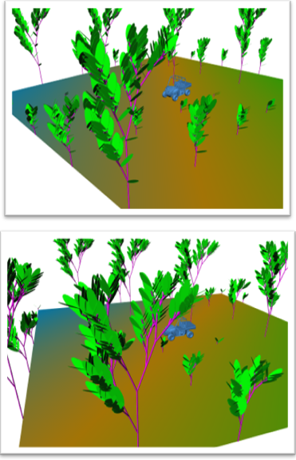

적용결과 pop보다는 push할때 이파리 추가하는 것이 좀 더 자연스러워 보였지만, + - 로 나눠질 때 이파리를 추가하는 게 좀 더 나아 보이는 결과를 가져왔습니다. 그리고 F에 이파리를 좀 더 넣되, 일정 반복횟수 이상일때는 빈도를 낮춰서 들어가야 어색해 보이지 않습니다. 이 조건이 상세하면 상세할 수록 더 자연스러운 모습이 나타날 것입니다.

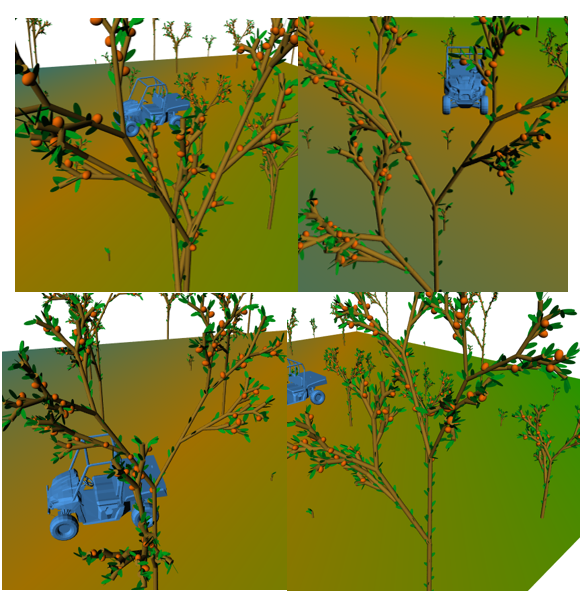

[다양한 설정을 적용한 이파리들의 모습. ]

```cpp
if ( str[i] == 'F' )
		{
			if (iteration > 3)
			{
				thick = 1.0f + (float)(str.size() - i) / str.size();
				out_mash += T * glm::scale(glm::vec3(thick, 1.01f, thick)) * trunk;
			}
			else
				out_mash += T * trunk;
			T = T * glm::translate(glm::vec3(0, g_d, 0));
			T = T * glm::rotate(g_delta_y, glm::vec3(0, 1, 0));

			if (i > 65 && i%2 == 0) {
				L = T * glm::rotate(2 * g_delta_x, glm::vec3(1, 0, 1)); //나뭇잎 
				out_mash += L * leaf;
			}
			else if ( i > 40 && i%5 == 0) {
				L = T * glm::rotate(2 * g_delta_x, glm::vec3(1, 0, 1)); //나뭇잎 
				out_mash += L * leaf;
			}
		}
```

[조건에 따라 이파리의 빈도 조정]

### 2.2.3 감 열매 추가

감나무 열매는 기본 매쉬를 sphere로 하고 크기를 작게, 감 모양에 가깝게 조금 찌그러트려주고, 이파리 생성 위치보다는 낮은 위치로 넣어주어야 합니다. 그리고 위에서 말한 것처럼 특정 레벨 이상에서만 생성되게 조건을 정의해줍니다.

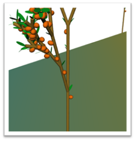

[줄기에 열매가 달려 부자연스러운 모습.]

레벨조건만 단다고 끝나는 것이 아니고, 특정 높이 이상에서만 생성되게 만들어 주어야 하는데, 그렇지 않으면 나무 줄기에 열매가 매달려버립니다. 또한 열매가 너무 많이 주렁주렁 달려있어도 어색하기 때문에 반복문이 3배수일 때만 생성되게 해주면 열매 숫자가 1/3로 줍니다. 거기에 열매가 생성될 위치와 회전도도 조정해주어야 자연스럽게 보입니다.

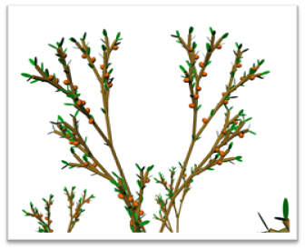

```cpp
if (iteration > 3 && i > 40 && i%3==0) { // 감열매
				G = T * glm::rotate(-g_delta_x, glm::vec3(1, 0, 0));
				G = G * glm::rotate(-g_delta_y, glm::vec3(0, 1, 0));
				G = G * glm::translate(glm::vec3(0.f, -0.03f, 0.f));
				out_mash += G * fruit;
			}
```

[특정 생장정도 이상에서만 열매가 달리게 지정하고, 열매가 달리는 빈도도 조절함.]

### 2.2.4 나무 굵기 조정

이제 나무를 좀더 건드려볼 차례입니다. 나무가 처음부터 끝까지 굵기가 일정하면 이상해 보이는데, 아랫쪽이나 가운데 큰 줄기는 잔가지에 비해 좀 더 굵게 보여야 하는게 맞기 때문입니다. 감열매에 했던 것처럼 특정 레벨 이상에서 특정 반복횟수 이하면 가지가 굵어 보이게 하는 식으로 조정하고 , 이때 가지의 굵기를 조절하는 값을 상수로 박지 말고, 반복횟수가 늘어날수록 부드럽게 줄어 들게끔 적용했습니다.

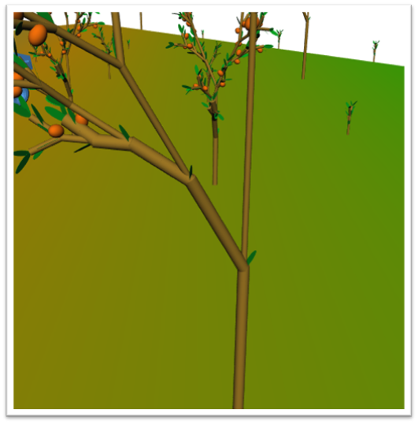

[굵기적용은 되었으나 확 깎이는 모양]

```cpp
if (iteration > 3)
			{
				thick = 1.0f + (float)(str.size() - i) / str.size();
				out_mash += T * glm::scale(glm::vec3(thick, 1.01f, thick)) * trunk;
			}
```

[반복문 진행도에 따른 굵기 조정]

L레벨이 3 이상일때만 해당 내용이 적용되게 하였고 그 결과, 특정 나이를 기준으로 확 늘게 하는 것보다 훨씬 자연스러운 모양이 나왔습니다.

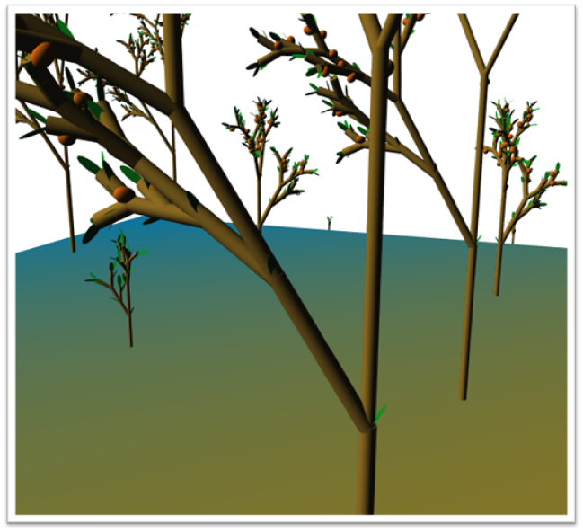

[확 꺾이는 부분은 여전하지만, 그 정도가 줄어들음.]

# 3. 텍스쳐 적용

텍스쳐의 경우는 적용하기 위해 수정해야 하는 부분들이 많았습니다. 텍스쳐가 생성되고 적용되는 과정은 다음과 같습니다.

```cpp
생성 :  CarGame0App.cpp -> init() -> InitGroundTexture() / GroundTexture.cpp -> LoadTexture()
 -> 텍스쳐 파일 로드, 매핑 방식 설정 -> UV좌표계에 대한 VBO 설정

적용 : CarGame0App.cpp -> draw() -> flag_texture 플래그 세팅 –>
> f_shader.glsl / 해당 플래그가 세팅된 경우 오브젝트에 대해 ambient 와 diffuse 를 다시계산 
-> DrawGroundTexture() / GroundTexture.cpp ->텍스쳐 바인드 -> flag_texture 플래그 해제
```

메인에서도 OpenIL/DevIL 라이브러리를 include를 시켜줘야 하는데, iLLnit()를 통해 사용하겠다는 정의를 내려야 하기 때문입니다. 이후 f/v shader에서 UV 좌표계를 이용하게 되는데, 텍스쳐를 사용하기 위해서는 UV 좌표계에 대한 shader 연산 또한 필요하기 때문입니다.

그 다음, bool 타입 flag_texture 변수를 이용하여 해당 빛이 텍스쳐가 적용된 대상에 닿는지 체크하고, 닿는다면 texture함수를 이용한 별도의 빛 연산을 수행하는 동작을 코드에 추가합니다.

마지막으로, cargameapp 에서 바닥을 그리는 작업이 끝나면 flag_texture를 false로 바꿔 빛을 원래대로 돌려줘야 합니다. 그렇지 않으면 다른 오브젝트들의 색이 제대로 적용되지 않습니다.

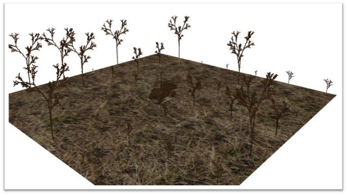

[텍스쳐 적용은 되었으나 색 적용에 문제 발생. ]

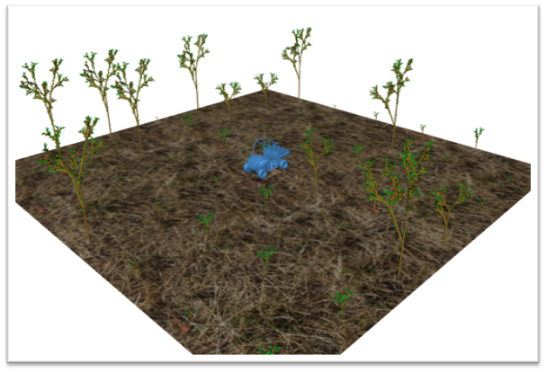

[다른 오브젝트들 에도 색상 적용 완료.]

# 4. 최종 결과

잔디 매쉬를 추가해서 바닥에 더 넣어보는 구현을 마지막으로 과제 제작이 끝났습니다. 키보드T 버튼을 누르면 나무들을 재생성 하여 원하는 이미지를 촬영해 볼 수 있습니다.

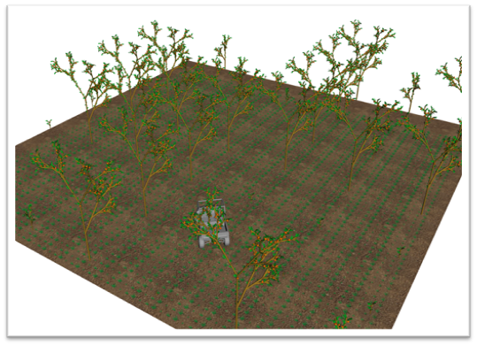

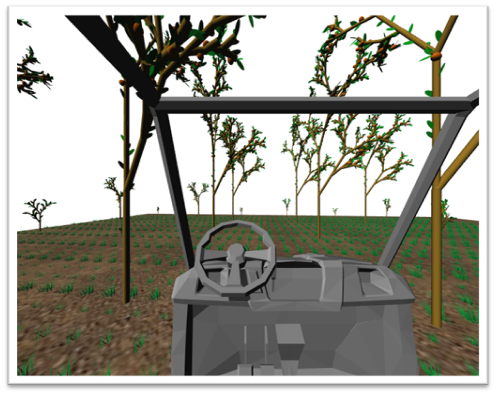

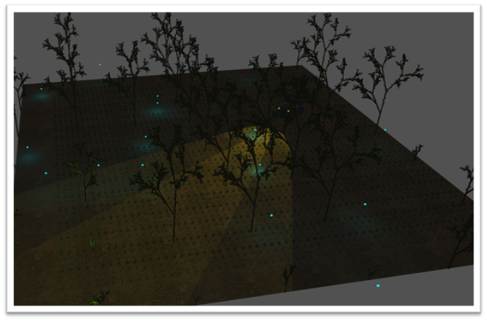

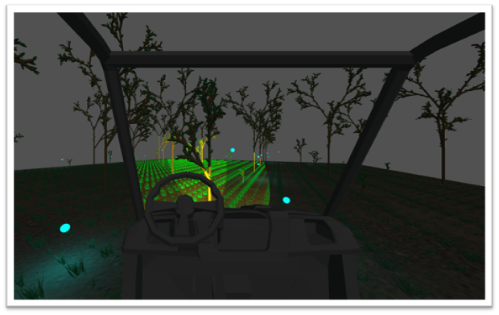

- Lsystem_final : 최종 과제 코드 디렉토리 